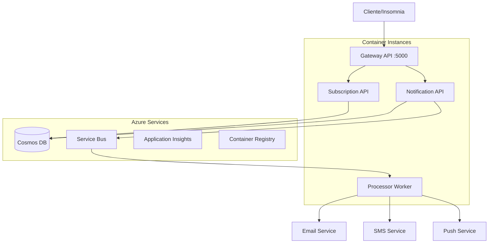

# 🚀 MultiChannel Notification System

Sistema de notificações multi-canal desenvolvido com arquitetura de microserviços, utilizando .NET 8, Docker, Azure Cosmos DB e Azure Service Bus.

## 📋 Índice

- [Visão Geral](#-visão-geral)
- [Arquitetura](#-arquitetura)
- [Tecnologias](#-tecnologias)
- [Desenvolvimento Local](#-desenvolvimento-local)
- [Deploy na Azure](#-deploy-na-azure)
- [Testes](#-testes)
- [Monitoramento](#-monitoramento)
- [Contribuição](#-contribuição)

## 🎯 Visão Geral

O MultiChannel Notification System é uma solução completa para envio de notificações através de múltiplos canais (Email, SMS, Push, etc.), com gerenciamento de preferências de usuários e processamento assíncrono.

### Funcionalidades Principais

- ✅ **API Gateway** - Ponto único de entrada para todas as requisições
- ✅ **Gerenciamento de Notificações** - CRUD completo de notificações
- ✅ **Gerenciamento de Subscriptions** - Preferências e configurações de usuários
- ✅ **Processamento Assíncrono** - Worker para processamento de notificações
- ✅ **Multi-Canal** - Suporte a Email, SMS, Push Notifications
- ✅ **Monitoramento** - Application Insights e Health Checks
- ✅ **Containerização** - Docker e Docker Compose
- ✅ **Infrastructure as Code** - Terraform para Azure
- ✅ **CI/CD** - Azure DevOps Pipeline

## 🏗️ Arquitetura



### Componentes

| Componente | Porta | Descrição |
|------------|-------|-----------|
| **Gateway API** | 5000 | API Gateway - ponto único de entrada |
| **Notification API** | Interna | Microserviço para gerenciamento de notificações |
| **Subscription API** | Interna | Microserviço para gerenciamento de subscriptions |
| **Processor Worker** | Interna | Worker para processamento assíncrono |

## 🛠️ Tecnologias

### Backend
- **.NET 8** - Framework principal
- **ASP.NET Core** - APIs REST
- **Entity Framework Core** - ORM
- **Serilog** - Logging estruturado
- **Swagger/OpenAPI** - Documentação da API

### Infraestrutura
- **Docker & Docker Compose** - Containerização
- **Azure Container Registry** - Registry de imagens
- **Azure Container Instances** - Hospedagem de containers
- **Azure Cosmos DB** - Banco de dados NoSQL
- **Azure Service Bus** - Mensageria
- **Azure Application Insights** - Monitoramento

### DevOps
- **Terraform** - Infrastructure as Code
- **Azure DevOps** - CI/CD Pipeline
- **GitHub Actions** - Automação (alternativa)

## 🚀 Desenvolvimento Local

### Pré-requisitos

- [Docker Desktop](https://www.docker.com/products/docker-desktop)
- [.NET 8 SDK](https://dotnet.microsoft.com/download/dotnet/8.0)
- [Git](https://git-scm.com/)

### Executando Localmente

1. **Clone o repositório**
   ```bash
   git clone https://github.com/seu-usuario/MultiChannel-Notification-System.git
   cd MultiChannel-Notification-System
   ```

2. **Suba os containers**
   ```bash
   docker-compose up -d
   ```

3. **Verifique se os serviços estão rodando**
   ```bash
   docker-compose ps
   ```

4. **Acesse os serviços**
   - Gateway API: http://localhost:5000
   - Swagger UI: http://localhost:5000/swagger
   - Health Check: http://localhost:5000/health

### Testando a API

1. **Importe a collection do Insomnia**
   - Arquivo: `docs/insomnia-collection.json`
   - Environment: "Base Environment" (local)

2. **Teste os endpoints principais**
   ```bash
   # Health Check
   curl http://localhost:5000/health
   
   # Criar notificação
   curl -X POST http://localhost:5000/api/notification \
     -H "Content-Type: application/json" \
     -d '{"userId":"user123","title":"Teste","message":"Funcionando!","channels":["Email"],"category":"System","priority":"Medium"}'
   
   # Buscar notificações do usuário
   curl http://localhost:5000/api/notification/user/user123
   ```

## ☁️ Deploy na Azure

### Pré-requisitos

- [Azure CLI](https://docs.microsoft.com/en-us/cli/azure/install-azure-cli)
- [Terraform](https://www.terraform.io/downloads.html)
- Subscription do Azure ativa

### Deploy Automatizado

1. **Execute o script de deploy**
   ```bash
   chmod +x scripts/deploy-azure.sh
   ./scripts/deploy-azure.sh
   ```

2. **Siga as instruções do script**
   - Login na Azure
   - Seleção da subscription
   - Configuração das variáveis

### Deploy Manual

1. **Configure as credenciais do Azure**
   ```bash
   az login
   az account set --subscription "sua-subscription-id"
   ```

2. **Configure as variáveis do Terraform**
   ```bash
   cd infrastructure/terraform
   cp terraform.tfvars.example terraform.tfvars
   # Edite o arquivo terraform.tfvars com suas configurações
   ```

3. **Execute o Terraform**
   ```bash
   terraform init
   terraform plan
   terraform apply
   ```

4. **Faça build e push das imagens**
   ```bash
   # Build local
   docker-compose build
   
   # Login no ACR
   az acr login --name seu-acr-name
   
   # Tag e push das imagens
   docker tag multichannel-notification-system-gateway-api:latest seu-acr.azurecr.io/gateway-api:latest
   docker push seu-acr.azurecr.io/gateway-api:latest
   # Repita para todas as imagens
   ```

### Configuração do CI/CD

1. **Configure o Azure DevOps**
   - Importe o repositório
   - Configure as service connections
   - Execute o pipeline `azure-pipelines.yml`

2. **Variáveis necessárias**
   - `azureServiceConnection`
   - `dockerRegistryServiceConnection`
   - `acrLoginServer`

## 🧪 Testes

### Testes Locais

```bash
# Executar todos os testes
dotnet test

# Executar com coverage
dotnet test --collect:"XPlat Code Coverage"
```

### Testes de Integração

```bash
# Com o sistema rodando localmente
dotnet test tests/IntegrationTests/ --environment Local

# Contra ambiente Azure
dotnet test tests/IntegrationTests/ --environment Azure
```

### Collection do Insomnia

A collection completa está disponível em `docs/insomnia-collection.json` com:

- ✅ Todos os endpoints funcionais
- ✅ Variáveis de ambiente (Local e Azure)
- ✅ Exemplos de requests
- ✅ Testes automatizados

## 📊 Monitoramento

### Application Insights

- **Métricas**: Performance, disponibilidade, uso
- **Logs**: Logs estruturados de todos os serviços
- **Alertas**: Configurados para falhas e performance

### Health Checks

- Gateway API: `/health`
- Notification API: `/health`
- Subscription API: `/health`

### Dashboards

Acesse o Azure Portal para visualizar:
- Métricas de performance
- Logs de aplicação
- Alertas configurados

## 🔧 Configuração

### Variáveis de Ambiente

#### Desenvolvimento Local
```env
ASPNETCORE_ENVIRONMENT=Development
Services__NotificationAPI=http://notification-api
Services__SubscriptionAPI=http://subscription-api
```

#### Produção Azure
```env
ASPNETCORE_ENVIRONMENT=Production
ConnectionStrings__CosmosDB=sua-connection-string
ConnectionStrings__ServiceBus=sua-connection-string
APPLICATIONINSIGHTS_CONNECTION_STRING=sua-connection-string
```

### Configurações do Terraform

Principais variáveis em `terraform.tfvars`:

```hcl
environment = "prod"
location = "East US"
container_cpu = 1.0
container_memory = 2.0
cosmos_throughput = 1000
servicebus_sku = "Standard"
```

## 📚 Documentação Adicional

- [Guia do Insomnia](docs/INSOMNIA_GUIDE.md)
- [Arquitetura Detalhada](docs/ARCHITECTURE.md)
- [Troubleshooting](docs/TROUBLESHOOTING.md)

## 🤝 Contribuição

1. Fork o projeto
2. Crie uma branch para sua feature (`git checkout -b feature/AmazingFeature`)
3. Commit suas mudanças (`git commit -m 'Add some AmazingFeature'`)
4. Push para a branch (`git push origin feature/AmazingFeature`)
5. Abra um Pull Request

## 📄 Licença

Este projeto está licenciado sob a MIT License - veja o arquivo [LICENSE](LICENSE) para detalhes.

## 👥 Autores

- **Seu Nome** - *Desenvolvimento inicial* - [SeuGitHub](https://github.com/seu-usuario)

## 🙏 Agradecimentos

- Equipe de DevOps
- Comunidade .NET
- Microsoft Azure

---

**Status do Projeto**: ✅ Funcional | 🚀 Em Produção | 📈 Em Desenvolvimento Ativo
